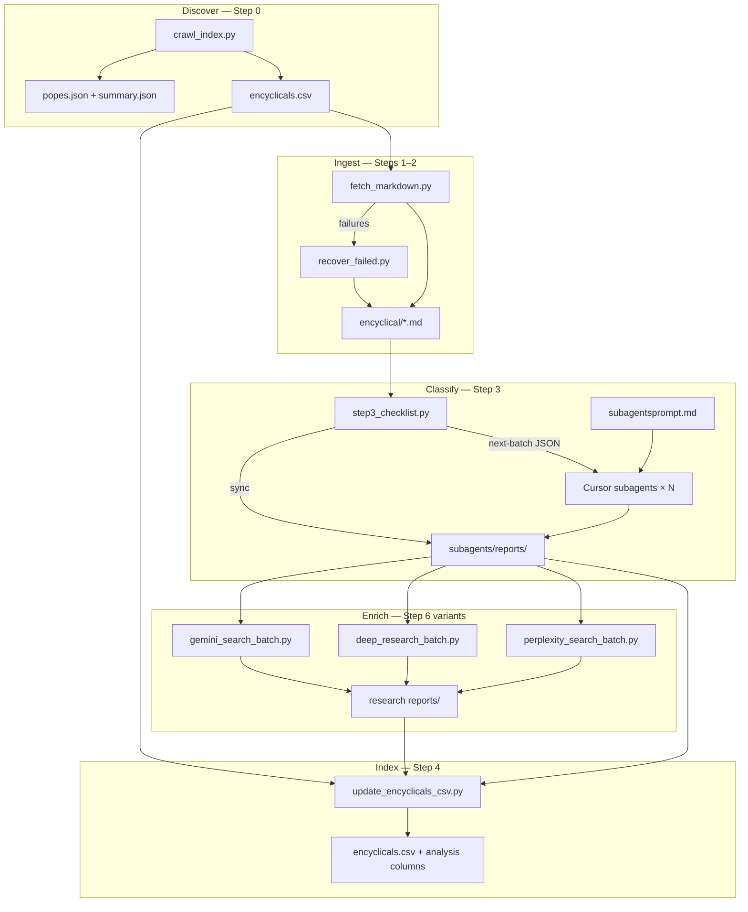

# How This Project Was Built

A reusable blueprint for **search → scrape → classify → index** pipelines over large document corpora.

This paper describes how the **Papal Papers** project was constructed: 520 indexed documents, 516 normalised markdown files, 516 LLM classification reports, and a growing set of deep-research gradient scores. Use it as a starter template when you need to discover a corpus, ingest it, run cheap LLM passes at scale via subagents, filter, and enrich with research-capable models.

For step-by-step operational commands, see [`RESEARCH_APPROACH.md`](RESEARCH_APPROACH.md). For the original creative intent, see [`brief.md`](brief.md).

---

## 1. The problem shape

Many research and creative projects start the same way:

1. There is a **canonical index** somewhere on the web (a site, API, or database).
2. Each entry links to a **primary document** (HTML, PDF, or both).
3. You need to **understand every document** at scale — classify, summarise, extract structured fields.
4. A subset needs **external context** — what was happening in the world, how accurate were the predictions, how was it cited.
5. Everything must land in a **queryable index** (CSV, database, or search engine) for downstream use.

Papal Papers applies this to 45 popes and ~520 papal documents, with the downstream goal of generating artwork from reflective vs prescriptive "textures." The pipeline shape is domain-agnostic; only the index source, classification labels, and scoring schema change.

---

## 2. Architecture at a glance

The project separates **deterministic ingest** (Python scripts, no LLM) from **probabilistic analysis** (LLM passes orchestrated by checklist scripts and Cursor subagents).



**Design principle:** crawl the index before downloading anything; never analyse a document you have not catalogued. Every artefact is a file on disk with a predictable name. Logs and checklists track state so work can stop and resume at any point.

---

## 3. Phase 0 — Discover and index

**Script:** `scripts/crawl_index.py`

Before fetching a single document, build a master CSV that answers: *what exists, who wrote it, when, where is it, what type is it?*

### What we did

1. Identified [papalencyclicals.net](https://www.papalencyclicals.net) as the canonical index.
2. Used its **WordPress REST API** (`/wp-json/wp/v2/`) instead of scraping rendered HTML — more stable, paginated, and cacheable.
3. For each pope (45 authors), crawled either a **category archive** (modern popes) or a **curated index page** (older popes with hand-maintained lists).
4. Parsed list items under section headers (`h3`) to infer document type (encyclical, bull, apostolic letter, etc.).

### Operational patterns worth copying

| Pattern | Implementation |
|---------|----------------|
| Rate limiting | 1 request/second between uncached calls |
| HTTP caching | Every API response → `data/cache/{key}.json` |
| Deduplication | Rows deduped by normalised URL; metadata merged across crawl paths |
| Validation | Spot-check known counts (e.g. Leo XIII ≈ 88 documents) |

### Outputs

- `data/encyclicals.csv` — one row per document (pope, title, date, doc_type, format, link, source)
- `data/popes.json` — author list with crawl metadata
- `data/summary.json` — per-author roll-up stats

```bash
python scripts/crawl_index.py
```

### Template swap

| Papal Papers | Your project |
|--------------|-------------|
| papalencyclicals.net REST API | Your index site, sitemap, or database export |
| `pope` column | author, organisation, jurisdiction, year |
| `doc_type` from section headers | your taxonomy (ruling, memo, report, etc.) |

---

## 4. Phase 1 — Scrape and normalise

**Script:** `scripts/fetch_markdown.py`

Turn every indexed URL into analysis-ready markdown with consistent frontmatter.

### Extraction strategy

1. **Prefer API over HTML scrape** where available (WordPress `posts?slug=…` returns clean content HTML).
2. **Site-specific CSS selectors** for fallbacks:
   - Vatican: `.testo` or `.documento`
   - papalencyclicals.net: `article.post`, `.entry-content`, or `main`
3. **Strip noise:** navigation, sidebars, share buttons, copyright blocks.
4. **Convert:** `html2text` with body width 0 (preserve line breaks), links kept, images ignored.
5. **Idempotent skip:** if output file exists and is > 200 bytes, do not re-download.

### File naming convention

```
{DDMMYYYY}_{Author}_{Title}.md
```

Example: `03102020_Francis_Fratelli tutti.md`

Date prefix enables chronological sort; author + title make files greppable without opening them. Reports mirror source names with a `run-` prefix.

### Markdown format

Each file gets YAML-style frontmatter plus the full body:

```markdown
# Fratelli tutti

*On Fraternity and Social Friendship*

---
pope: Francis
title: Fratelli tutti
published_date: 2020-10-03
doc_type: encyclical
source: http://www.vatican.va/content/...
---

[Full document body in markdown]
```

### Audit trail

`data/fetch_log.json` records every success, skip, and failure:

```json
{
  "success": [{"file": "...", "link": "..."}],
  "skipped": [{"file": "...", "link": "..."}],
  "failed": [{"file": "...", "link": "...", "error": "..."}]
}
```

```bash
python scripts/fetch_markdown.py
```

---

## 5. Phase 1b — Failure recovery

**Script:** `scripts/recover_failed.py`

Primary links break. Build a recovery layer instead of accepting gaps.

### Resolution order

1. **Manual overrides** — hard-coded map for known mismatches (wrong attribution, moved URLs).
2. **Vatican index matching** — scrape each pope's Vatican archive; fuzzy-match document title to link.
3. **Third-party archives** — franciscan-archive.org, documentacatholicaomnia.eu, thelatinlibrary.com.
4. **Skip list** — index pages and stub entries that are not real documents.

### Matching heuristic

- Normalise titles (strip accents, lowercase, remove punctuation).
- Score by word overlap; boost exact substring matches.
- Accept when score ≥ 2 (or ≥ 1 for single-word titles).

**Result in this project:** 71 initial failures → 68 recovered → 3 skipped (stubs) → 0 still failed.

Recovered documents get an `alternate_source:` field in frontmatter. Results merge back into `fetch_log.json` and `recovery_log.json`.

---

## 6. Phase 2 — Classify with subagents (the core LLM pattern)

**Orchestrator:** `scripts/step3_checklist.py`  
**Prompt:** `data/subagents/subagentsprompt.md`  
**Model tier:** cheap / fast (e.g. `claude-4.6-sonnet-medium-thinking`)

This is the most transferable part of the build: **one document per subagent, orchestrated by a checklist state machine, with disk as the source of truth.**

### Why subagents?

Processing 516 documents in a single agent context window is impossible. Processing them one-at-a-time in serial is slow. The solution:

1. A **Python checklist script** manages state (pending → in_progress → complete).
2. Each batch, the orchestrator emits JSON describing 30 documents.
3. A **parent Cursor agent** launches 30 **parallel subagents**, each given one input path and one output path.
4. Each subagent reads the source markdown, writes a report file, and exits.
5. The orchestrator **syncs** checklist state from disk (report exists and > 500 bytes = complete).
6. Repeat until done.

### The checklist pattern

Every AI pass uses the same primitives:

```
checklist.json   →  state machine per item
run_log.jsonl    →  append-only event log
reports/         →  one output file per input, named predictably
prompt.md        →  agent instructions (config, not code)
```

**Commands:**

```bash
python scripts/step3_checklist.py init          # Build checklist from corpus
python scripts/step3_checklist.py next-batch    # Claim next 30 items → JSON stdout
python scripts/step3_checklist.py sync          # Mark complete where reports exist
python scripts/step3_checklist.py status        # Progress summary
python scripts/step3_checklist.py reset-stale   # Reset stuck in_progress items
```

### Typical parent-agent workflow

```
loop until status shows 100% complete:
  1. run `next-batch` → get JSON with 30 items
  2. for each item in parallel:
       launch subagent with prompt file + INPUT_PATH + OUTPUT_PATH
  3. run `sync`
  4. run `status`
```

Each subagent receives the prompt from `subagentsprompt.md` with `{INPUT_PATH}` and `{OUTPUT_PATH}` substituted. The subagent must **write the report to disk** — chat output alone does not count.

### Step 3 design rules

| Rule | Rationale |
|------|-----------|
| One document per agent | Focused context; isolated failures |
| Text only — no web research | Separates "what the document says" from "what was happening" |
| Structured + unstructured output | Machine fields for filtering; prose for human review |
| Idempotent | Skip if report already exists and > 500 bytes |
| Honest gaps | Write `Not stated in text` rather than hallucinate |

### Report format (Pass 1)

```markdown
---
source_file: data/encyclical/03102020_Francis_Fratelli tutti.md
report_file: data/subagents/reports/run-03102020_Francis_Fratelli tutti.md
pass: step-3-theme-extraction
---

# Fratelli tutti

## Structured

- **Key theme:** Spiritual | Social | Mixed
- **Theme (one sentence):**
- **Summary:** (one short paragraph)
- **Response to:** (what the document says it responds to)
- **Prescriptive towards:** (what the document anticipates or directs toward)
- **Tension:** (tensions named or implied in the text)

## Unstructured

Free-form analysis grounded in the text only.
```

### Classification results (this project)

| Key theme | Count | Sent to deep research? |
|-----------|-------|------------------------|
| Mixed | 333 | Yes (default filter) |
| Spiritual | 163 | No |
| Social | 23 | Yes |
| Unparseable | 1 | Manual review |

**516 / 516 reports completed.**

---

## 7. Phase 3 — Merge analysis back into the index

**Script:** `scripts/update_encyclicals_csv.py`

The master CSV becomes queryable without opening individual report files.

### What it merges

| Source | Fields extracted |
|--------|-----------------|
| Step 3 reports | `category` (Key theme), `summary` |
| Step 6 reports | `reflective_saturation`, `reflective_density`, `prescriptive_saturation`, `prescriptive_density` |

Gradient sources are tried in priority order: `perplexity-search/reports/` → `deep-research/reports/`.

```bash
python scripts/update_encyclicals_csv.py          # write updated CSV
python scripts/update_encyclicals_csv.py --dry-run  # preview counts
```

This is pure Python regex/JSON parsing — no LLM needed. The structured fields in Step 3 reports (`**Key theme:**`) and the JSON block in Step 6 reports (`## Gradients`) are designed specifically so downstream code can extract without LLM parsing.

---

## 8. Phase 4 — Deep research on a filtered subset

Not every document needs expensive research. Step 3 classification filters the corpus; Step 6 runs only on `Social` and `Mixed` documents (~356 items).

Three batch runners share the same checklist pattern as Step 3, but call external APIs instead of Cursor subagents:

| Script | Model / API | Output dir | Use case |
|--------|-------------|------------|----------|
| `perplexity_search_batch.py` | Perplexity `sonar-pro` (sync) | `data/perplexity-search/` | Fast web-grounded research |
| `deep_research_batch.py` | Perplexity `sonar-deep-research` (async) | `data/deep-research/` | Thorough multi-source research |
| `gemini_search_batch.py` | Gemini 3.1 Flash Lite | `data/Gemini3.1Flash/` | Alternative research tier |

All three:

1. Read Step 3 theme summary as **hypothesis, not fact**.
2. Build a query from document metadata + prompt sections (`prompt.md`).
3. Save rendered queries to `queries/{id:04d}.md` for inspection.
4. Write report + optional raw JSON sidecar on completion.
5. Support `init`, `status`, `run --concurrency N`, `sync`, `reset-stale`.

Default init filter: `Key theme ∈ {Social, Mixed}`. Override with `--include-themes all`.

### Step 6 output schema

Machine-readable JSON **immediately after the title**:

```markdown
# {Title}

## Gradients

```json
{
  "reflective": {
    "saturation": 7,
    "density": -12
  },
  "prescriptive": {
    "saturation": 4,
    "density": 5
  }
}
```

- `saturation`: 1–10 (how strongly the document acts on this axis)
- `density`: −30 to +30 years from publication (negative = backward gaze, positive = forward)

Followed by structured sections (Context, Reflective, Prospective, Citations) and unstructured narrative.

**Evidence rule:** sparse output is correct when evidence is sparse. `insufficient evidence` is a valid finding.

---

## 9. Cross-cutting patterns (copy these)

These patterns are the reusable kernel. Copy them wholesale into a new project.

### 9.1 Model tiering

```
Pass 1 (Step 3)  →  cheap model + subagents     →  classify + summarise from local text
Pass 2 (Step 5)  →  better model + subagents     →  extract textures from filtered subset [planned]
Pass 3 (Step 6)  →  research model + API batch   →  external verification + scoring
```

Never pay research-model prices for work a cheap model can do on local text.

### 9.2 Checklist as state machine

```json
{
  "meta": { "step": 3, "pass": "theme-extraction", "batch_size": 30, "total": 516 },
  "items": [
    {
      "id": 1,
      "source_file": "data/encyclical/...",
      "report_file": "data/subagents/reports/run-...",
      "status": "pending|in_progress|complete|failed|skipped",
      "batch_id": null,
      "started_at": null,
      "completed_at": null,
      "error": null
    }
  ]
}
```

**Disk is the source of truth for completion.** The checklist tracks intent; `sync` reconciles by checking report file size.

### 9.3 Idempotent everything

| Layer | Idempotency mechanism |
|-------|----------------------|
| Crawl | HTTP response cache |
| Fetch | Skip if output file exists and > 200 bytes |
| AI reports | Skip if report exists and > 500 bytes |
| Checklist | `sync` marks complete from disk; `reset-stale` clears stuck `in_progress` |

Stop and restart at any point without redoing finished work.

### 9.4 Prompt as config

Prompts live in markdown files with named sections. Batch runners parse sections and inject them into queries. Edit the prompt without changing Python code.

### 9.5 Parallel subagents with serial checklist

- **Parallelism:** 30 subagents per batch (Step 3) or concurrency=N API jobs (Step 6).
- **Serial safety:** checklist marks items `in_progress` before agents start; `sync` after batch completes.
- **Stale recovery:** `reset-stale` returns orphaned `in_progress` items to `pending`.

---

## 10. Repository layout

```
project-root/
├── brief.md                         # Original intent and downstream goals
├── HOW_IT_WAS_BUILT.md              # This document — build narrative + template
├── RESEARCH_APPROACH.md             # Operational playbook with command reference
├── requirements.txt                 # Python deps for ingest scripts
├── scripts/
│   ├── crawl_index.py               # Step 0: discover index
│   ├── fetch_markdown.py            # Steps 1–2: download + normalise
│   ├── recover_failed.py            # Failure recovery
│   ├── step3_checklist.py           # Step 3: subagent orchestration
│   ├── update_encyclicals_csv.py    # Step 4: merge analysis into CSV
│   ├── perplexity_search_batch.py   # Step 6: Perplexity sonar-pro
│   ├── deep_research_batch.py       # Step 6: Perplexity deep research
│   └── gemini_search_batch.py       # Step 6: Gemini research tier
└── data/
    ├── encyclicals.csv              # Master index + analysis columns
    ├── summary.json                 # Per-author stats
    ├── popes.json                   # Author list
    ├── fetch_log.json               # Download audit
    ├── recovery_log.json            # Recovery audit
    ├── cache/                       # HTTP cache (gitignored)
    ├── encyclical/                  # Normalised markdown corpus (516 files)
    ├── subagents/                   # Step 3 pass
    │   ├── subagentsprompt.md
    │   ├── checklist.json
    │   ├── run_log.jsonl
    │   └── reports/
    ├── perplexity-search/           # Step 6 sonar-pro pass
    ├── deep-research/               # Step 6 deep research pass
    └── Gemini3.1Flash/              # Step 6 Gemini pass
```

---

## 11. Starting a similar project — checklist

Use this when forking the pattern for court rulings, annual reports, policy papers, or any indexed document corpus.

### Define

- [ ] Write `brief.md` — what questions, what downstream use, what structured fields matter
- [ ] Identify the canonical index source (site, API, export)
- [ ] Define CSV schema and filename convention
- [ ] Define Pass 1 classification axis (e.g. `Procedural | Substantive | Mixed`)

### Build ingest (no LLM)

- [ ] Copy and adapt `crawl_index.py` for your index source
- [ ] Copy and adapt `fetch_markdown.py` with your site-specific selectors
- [ ] Add recovery script or manual override map for broken links
- [ ] Run ingest; verify corpus count against index count

### Build classify (cheap LLM + subagents)

- [ ] Write Pass 1 prompt with `## Structured` and `## Unstructured` sections
- [ ] Copy `step3_checklist.py`; adjust paths and batch size
- [ ] Run `init` → loop `next-batch` / parallel subagents / `sync` until complete
- [ ] Review classification distribution; decide filter for expensive passes

### Build index merge

- [ ] Copy `update_encyclicals_csv.py`; adjust regex patterns for your structured fields
- [ ] Run merge; verify column fill rates

### Build enrich (research model, optional)

- [ ] Write deep research prompt with JSON output block first
- [ ] Copy one batch runner (`perplexity_search_batch.py` is a good starting point)
- [ ] Filter to relevant subset from Pass 1
- [ ] Run batch; merge scores back into CSV

### Minimum viable pipeline

If you only need the essentials:

1. Index CSV (one row per document)
2. Normalised markdown corpus
3. One AI pass with checklist orchestration
4. One structured output field for filtering
5. Merge script back into CSV

Add recovery, multi-pass analysis, and external research as the corpus demands.

---

## 12. Adapting classification and scoring

### Classification axis (Step 3)

Papal Papers uses `Spiritual | Social | Mixed`. For other corpora:

| Domain | Example axis |
|--------|-------------|
| Legal | `Procedural | Substantive | Mixed` |
| Corporate | `Operational | Strategic | Regulatory | Mixed` |
| Journalism | `Descriptive | Analytical | Prescriptive | Mixed` |

The pattern stays the same: **cheap pass to classify → filter → expensive pass on subset**.

### Scoring axes (Step 6)

Papal Papers uses `reflective/prescriptive × saturation/density` for an art pipeline. Define your own JSON schema:

```json
{
  "axis_a": {"intensity": 1, "time_horizon": -30},
  "axis_b": {"intensity": 1, "time_horizon": 30}
}
```

Place machine-readable JSON **first** in the report so Python can extract without LLM parsing.

---

## 13. Metrics from this build

| Metric | Value |
|--------|-------|
| Authors indexed | 45 popes |
| Documents in CSV | 520 |
| Markdown corpus files | 516 |
| Initial fetch failures | 71 → 0 after recovery |
| Documents recovered via alternate sources | 68 |
| Documents skipped (index stubs) | 3 |
| Step 3 reports completed | 516 / 516 |
| Key theme: Mixed | 333 |
| Key theme: Spiritual | 163 |
| Key theme: Social | 23 |
| CSV rows with category + summary | 516 |
| CSV rows with gradient scores | 22 (Step 6 in progress) |
| Deep research reports | 46 (deep-research) + 2 (perplexity-search) + 6 (Gemini) |

---

## 14. Dependencies

```bash
python -m venv .venv
source .venv/bin/activate
pip install -r requirements.txt
```

```
httpx>=0.27.0
beautifulsoup4>=4.12.0
html2text>=2024.2.26
```

For Step 6 batch runners, add API keys to `.env` (gitignored):

```
PERPLEXITY_API_KEY=...
GEMINI_PRO=...
```

---

## 15. Related documents

| File | Role |
|------|------|
| [`brief.md`](brief.md) | Original project vision, art pipeline, open design questions |
| [`RESEARCH_APPROACH.md`](RESEARCH_APPROACH.md) | Detailed operational playbook and command reference |
| [`data/subagents/subagentsprompt.md`](data/subagents/subagentsprompt.md) | Step 3 subagent instructions |
| [`data/deep-research/prompt.md`](data/deep-research/prompt.md) | Step 6 research instructions and output schema |
| [`scripts/`](scripts/) | Deterministic ingest and orchestration |
