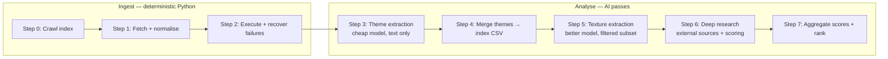

# Research Approach

A reusable playbook for turning a large corpus of primary-source documents into structured, machine-readable research outputs — derived from the **Papal Papers** project (516 papal documents, 520 indexed sources, 45 popes).

Use this as a template: swap the domain (encyclicals → court rulings, annual reports, policy papers), keep the pipeline shape.

> **Build narrative and starter template:** see [`HOW_IT_WAS_BUILT.md`](HOW_IT_WAS_BUILT.md) for how the project was constructed end-to-end (index crawl → scrape → subagent classification → index merge → deep research).

---

## 1. What this approach optimises for

| Goal | How the pipeline serves it |
|------|---------------------------|
| **Completeness** | Crawl an authoritative index first; never analyse documents you haven't catalogued |
| **Reproducibility** | Every artefact is a file on disk with a stable name; logs and checklists track state |
| **Cost control** | Cheap models for text-only passes; expensive models only where external research is needed |
| **Separation of concerns** | Text analysis (what the document says) vs historical research (what the world was doing) |
| **Downstream use** | Structured fields + JSON blocks for code; unstructured prose for human review and art direction |

The original project brief (`brief.md`) frames the end goal: extract **textures** (reflective vs prescriptive stance, temporal reach, social tension) from papal writings that engage the secular world, then feed an artwork pipeline. The research architecture below is domain-agnostic even when the examples are papal.

---

## 2. Pipeline overview



**Status in Papal Papers (as of project snapshot):**

| Step | Status | Output |
|------|--------|--------|
| 0 | Done | `data/encyclicals.csv`, `data/summary.json`, `data/popes.json` |
| 1–2 | Done | 516 markdown files in `data/encyclical/` |
| Recovery | Done | 68 documents recovered via alternate sources |
| 3 | Done | 516 theme reports in `data/subagents/reports/` |
| 4 | Done | `update_encyclicals_csv.py` merges category, summary, gradients into CSV |
| 5 | Planned | Second-pass texture reports for Social/Mixed documents |
| 6 | In progress | Three batch runners: `perplexity-search/`, `deep-research/`, `Gemini3.1Flash/` |
| 7 | Planned | Temporal gradient scoring and pope-level ranking |

---

## 3. Repository layout

```
project-root/
├── brief.md                    # Original intent, downstream art goals
├── HOW_IT_WAS_BUILT.md         # Build narrative + starter template
├── RESEARCH_APPROACH.md        # This document
├── requirements.txt            # Python deps for ingest scripts
├── scripts/
│   ├── crawl_index.py          # Step 0
│   ├── fetch_markdown.py       # Steps 1–2
│   ├── recover_failed.py       # Failure recovery
│   ├── step3_checklist.py      # Step 3 orchestration
│   ├── update_encyclicals_csv.py  # Step 4: merge reports into CSV
│   ├── perplexity_search_batch.py # Step 6: Perplexity sonar-pro
│   ├── deep_research_batch.py  # Step 6: Perplexity deep research
│   └── gemini_search_batch.py  # Step 6: Gemini research tier
└── data/
    ├── encyclicals.csv         # Master index (one row per document)
    ├── summary.json            # Per-author aggregate stats
    ├── popes.json              # Author list from crawl
    ├── fetch_log.json          # Download success/skip/fail
    ├── recovery_log.json       # Alternate-source recovery results
    ├── cache/                  # Crawl HTTP cache (gitignored)
    ├── encyclical/             # Normalised markdown corpus
    ├── subagents/              # Step 3 pass
    │   ├── subagentsprompt.md
    │   ├── checklist.json
    │   ├── run_log.jsonl
    │   ├── batches/
    │   └── reports/
    ├── perplexity-search/      # Step 6 sonar-pro pass
    ├── deep-research/          # Step 6 deep research pass
    └── Gemini3.1Flash/         # Step 6 Gemini pass
        (each: prompt.md, checklist.json, run_log.jsonl, queries/, reports/)
```

**Naming convention for corpus files:**

```
{DDMMYYYY}_{Author}_{Title}.md
```

Example: `03102020_Francis_Fratelli tutti.md`

- Date prefix enables chronological sorting.
- Author + title make files human-greppable without opening them.
- Reports mirror source names with a `run-` prefix: `run-03102020_Francis_Fratelli tutti.md`.

---

## 4. Step 0 — Build the index (crawl)

**Script:** `scripts/crawl_index.py`

**Purpose:** Discover every document before downloading anything. The index is the source of truth for what exists, where it lives, and what type it is.

### Source strategy

1. Find a **canonical index site** (here: [papalencyclicals.net](https://www.papalencyclicals.net)).
2. Use its **WordPress REST API** (`/wp-json/wp/v2/`) where available — more reliable than scraping rendered HTML.
3. For each author (pope), crawl either:
   - a **category archive** (modern popes), or
   - a **curated index page** (older popes with hand-maintained lists).
4. Parse list items under section headers (`h3`) to infer document type (encyclical, bull, apostolic letter, etc.).

### Operational details

- **Rate limiting:** 1 request/second between uncached calls.
- **HTTP caching:** Every API response cached to `data/cache/{key}.json` so re-runs are fast and polite.
- **Deduplication:** Rows deduped by normalised URL; metadata merged when duplicates appear from multiple crawl paths.
- **Validation:** Spot-check known counts (e.g. Leo XIII ≈ 88 documents, Francis encyclicals = 4).

### Outputs

**`data/encyclicals.csv`** — one row per document:

| Column | Description |
|--------|-------------|
| `pope` | Author name |
| `title` | Document title |
| `subtitle` | Subtitle if present in index |
| `published_date` | ISO date (`YYYY-MM-DD`) |
| `doc_type` | encyclical, bull, apostolic_letter, etc. |
| `format` | `html` or `pdf` |
| `link` | Primary download URL |
| `source` | `papalencyclicals`, `vatican`, or `external` |
| `pope_url` | Author index page |
| `notes` | e.g. `deduped` |

**`data/summary.json`** — per-author roll-up: document count, type breakdown, date range.

**`data/popes.json`** — author list with crawl metadata (name, URL, slug, source type).

### Run

```bash
python scripts/crawl_index.py
```

---

## 5. Steps 1–2 — Fetch and normalise to markdown

**Script:** `scripts/fetch_markdown.py`

**Purpose:** Turn every indexed URL into a clean, analysis-ready markdown file with consistent frontmatter.

### Extraction strategy

1. **Prefer API over HTML scrape** for papalencyclicals.net (WordPress `posts?slug=…` endpoint returns clean content HTML).
2. **Site-specific selectors:**
   - Vatican: `.testo` or `.documento`
   - papalencyclicals.net: `article.post`, `.entry-content`, or `main`
3. **Strip noise:** nav, sidebars, share buttons, copyright blocks, "Continue reading" links.
4. **Convert:** `html2text` with body width 0 (preserve line breaks), links kept, images ignored.
5. **Skip existing:** If output file exists and is > 200 bytes, skip (idempotent re-runs).

### Markdown file format

Each document becomes a markdown file with YAML-style frontmatter:

```markdown
# Fratelli tutti

*On Fraternity and Social Friendship*

---
pope: Francis
title: Fratelli tutti
subtitle: On Fraternity and Social Friendship
published_date: 2020-10-03
doc_type: encyclical
source: http://www.vatican.va/content/francesco/en/encyclicals/documents/...
---

[Full document body in markdown]
```

If recovered from an alternate URL, add `alternate_source: …`.

### Logging

**`data/fetch_log.json`:**

```json
{
  "success": [{"file": "...", "link": "..."}],
  "skipped": [{"file": "...", "link": "..."}],
  "failed": [{"file": "...", "link": "...", "error": "..."}]
}
```

Project snapshot: 449 skipped (already on disk), 68 success (via recovery), 0 failed.

### Run

```bash
python scripts/fetch_markdown.py
```

---

## 6. Failure recovery — alternate sources

**Script:** `scripts/recover_failed.py`

Not every primary link works. Build a **recovery layer** rather than accepting gaps.

### Resolution order

1. **Manual overrides** — hard-coded link map for known mismatches (wrong attribution, moved URLs).
2. **Vatican index matching** — scrape each pope's Vatican archive page; fuzzy-match document title to link.
3. **Third-party archives** — franciscan-archive.org, documentacatholicaomnia.eu, thelatinlibrary.com.
4. **Skip list** — index pages and stub entries that aren't real documents.

### Matching heuristic

- Normalise titles (strip accents, lowercase, remove punctuation).
- Score by word overlap; boost exact substring matches.
- Accept match when score ≥ 2 (or ≥ 1 for single-word titles).

### Logging

**`data/recovery_log.json`:**

```json
{
  "recovered": [{"file": "...", "alternate_source": "...", "method": "vatican_match|manual"}],
  "skipped": [{"file": "...", "reason": "index_or_stub_entry"}],
  "still_failed": [{"file": "...", "error": "..."}]
}
```

Recovery results are merged back into `fetch_log.json`.

---

## 7. Step 3 — First AI pass: theme extraction (text only)

**Orchestrator:** `scripts/step3_checklist.py`  
**Prompt:** `data/subagents/subagentsprompt.md`  
**Model tier:** Cheap / fast (e.g. `claude-4.6-sonnet-medium-thinking`)

### Design principles

| Principle | Rationale |
|-----------|-----------|
| **One document per agent run** | Keeps context focused; failures are isolated |
| **Text only — no external research** | Separates "what the document says" from "what was happening in the world" |
| **Structured + unstructured output** | Machine fields for filtering; prose for human review |
| **Idempotent** | Skip if report already exists and > 500 bytes |
| **Batch orchestration** | Process 30 at a time via parallel subagents |

### The checklist pattern

Every AI pass uses the same orchestration primitives:

```
checklist.json   →  state machine (pending → in_progress → complete/failed)
run_log.jsonl    →  append-only event log (init, next_batch, sync, mark, reset_stale)
reports/         →  one output file per input, named predictably
```

**Commands:**

```bash
python scripts/step3_checklist.py init          # Build checklist from corpus
python scripts/step3_checklist.py next-batch    # Claim next 30 items (JSON to stdout)
python scripts/step3_checklist.py sync          # Mark complete where reports exist on disk
python scripts/step3_checklist.py status        # Progress summary
python scripts/step3_checklist.py reset-stale   # Reset stuck in_progress items
python scripts/step3_checklist.py mark 14 complete
```

**Typical subagent workflow:**

1. Run `next-batch` → get JSON payload with 30 items.
2. Launch parallel subagents (one per item), each given `{INPUT_PATH}` and `{OUTPUT_PATH}`.
3. Subagent reads source markdown, writes report file.
4. Run `sync` to reconcile checklist with disk.
5. Repeat until all items complete.

### Step 3 report format

```markdown
---
source_file: data/encyclical/03102020_Francis_Fratelli tutti.md
report_file: data/subagents/reports/run-03102020_Francis_Fratelli tutti.md
pass: step-3-theme-extraction
---

# {Title}

## Structured

- **Key theme:** Spiritual | Social | Mixed
- **Theme (one sentence):**
- **Summary:** (one short paragraph)
- **Response to:** (what the document itself says it responds to)
- **Prescriptive towards:** (what the document itself anticipates or directs toward)
- **Tension:** (tensions named or implied in the text)

## Unstructured

Free-form analysis: argument flow, tone, notable framing. Grounded in the text only.
```

### Classification results (Papal Papers)

| Key theme | Count | Next pass? |
|-----------|-------|------------|
| Mixed | 333 | Yes (Step 6 default filter) |
| Spiritual | 163 | Skip deep research unless needed |
| Social | 23 | Yes |
| Unparseable | 1 | Manual review |

**Critical rule:** Step 3 agents must **not** use outside knowledge. If the text doesn't support a field, write `Not stated in text`. This keeps Pass 1 honest and makes Pass 2 (external research) meaningful.

---

## 8. Step 4 — Merge analysis into the index

**Script:** `scripts/update_encyclicals_csv.py`

**Purpose:** Make the master CSV queryable without opening individual reports.

Parses Step 3 reports for `category` (Key theme) and `summary`, and Step 6 reports for gradient JSON (`reflective_saturation`, `reflective_density`, `prescriptive_saturation`, `prescriptive_density`).

Gradient sources are tried in priority order: `data/perplexity-search/reports/` → `data/deep-research/reports/`.

```bash
python scripts/update_encyclicals_csv.py
python scripts/update_encyclicals_csv.py --dry-run   # preview fill counts
```

No AI needed — pure regex and JSON parsing against the structured report formats.

---

## 9. Step 5 — Second AI pass: texture extraction (planned)

**Purpose:** For Social and Mixed documents, run a **better model** to extract fine-grained textures from the text itself:

- Social tension
- Prescriptive towards / reflective towards
- Specific secular ideas mentioned
- Urgency, tone, weight

Same checklist pattern as Step 3, but:

- Filter input to `Key theme ∈ {Social, Mixed}` (~356 documents).
- Use a stronger model.
- Prompt asks for scored/ranked fields, still grounded in primary text.

Step 5 output becomes additional structured columns or a parallel report directory (e.g. `data/textures/reports/`).

---

## 10. Step 6 — Deep research (external sources)

Three batch runners share the same checklist pattern; pick one or run in parallel on different subsets:

| Script | Model | Output dir |
|--------|-------|------------|
| `scripts/perplexity_search_batch.py` | Perplexity `sonar-pro` (sync) | `data/perplexity-search/` |
| `scripts/deep_research_batch.py` | Perplexity `sonar-deep-research` (async) | `data/deep-research/` |
| `scripts/gemini_search_batch.py` | Gemini 3.1 Flash Lite | `data/Gemini3.1Flash/` |

**Prompt:** each pass has its own `prompt.md` (Gemini reuses the Perplexity prompt by default).

### Design shift from Step 3

| Step 3 | Step 6 |
|--------|--------|
| Text of document only | Primary URL + external sources |
| Cheap model | Research-capable model with web access |
| Classify themes | Score reflective/prescriptive gradients |
| No judgment on accuracy | Measure prescience vs irrelevance |

### Query construction

For each document, the batch runner builds a query from:

1. Document metadata (pope, title, date, URLs)
2. Full Step 3 theme summary (as hypothesis, not fact)
3. Sections from `prompt.md`: project context, research instructions, output format, constraints

Rendered queries saved to `data/deep-research/queries/{id:04d}.md` for inspection.

### Filtering

Default init filter: `Key theme ∈ {Social, Mixed}`. Override with `--include-themes all`.

### Async batch execution

```bash
# Perplexity sonar-pro (sync, fast)
python scripts/perplexity_search_batch.py init --include-themes Mixed
python scripts/perplexity_search_batch.py run --concurrency 3

# Perplexity deep research (async, thorough)
python scripts/deep_research_batch.py init
python scripts/deep_research_batch.py run --concurrency 5

# Gemini (alternative tier)
python scripts/gemini_search_batch.py init --include-themes Mixed
python scripts/gemini_search_batch.py run --concurrency 2

# All runners support: status, sync, reset-stale
```

- Deep research: async API with polling (15s → 120s backoff cap).
- Sonar / Gemini: synchronous requests with retry and rate-limit handling.
- Writes report + optional raw JSON sidecar on completion.
- Resumable: re-run `run` to pick up pending/failed items.
- Quota exhaustion stops the batch cleanly; reset failed items and retry.

Requires `PERPLEXITY_API_KEY` and/or `GEMINI_PRO` in `.env`.

### Step 6 report format

The prompt enforces a strict structure. **The JSON gradients block must appear immediately after the title** — this is the machine-readable canonical output.

```markdown
# {Title}

## Gradients

```json
{
  "reflective": {
    "saturation": 7,
    "density": -12
  },
  "prescriptive": {
    "saturation": 4,
    "density": 5
  }
}
```

- `saturation`: 1–10 (how strongly the document acts on this axis)
- `density`: −30 to +30 years from publication (negative = backward gaze, positive = forward)

---

## Structured

### Context
### Reflective
### Prospective
### Temporal gradients (justifications matching JSON integers)

---

## Unstructured

1. Circumstances that led to the document
2. Relevance — then and now
3. Citation in academia and secular media
4. Policy and material consequences
5. The author's position and authority

### Citations
| # | Type | Author / Outlet | Title | Year | URL |
```

**Source type discipline:** Citations tagged as `historical_record`, `media`, `academic`, `primary_text`, `archival`, or `other`. Never conflate press coverage with verified policy impact.

**Evidence rule:** Sparse output is correct when evidence is sparse. `insufficient evidence` is a valid finding.

---

## 11. Step 7 — Scoring and ranking (planned)

Combine Step 6 gradient JSON across the corpus to:

1. Score each document's reflective vs prescriptive character.
2. Build temporal context maps (how long topics remained socially relevant after publication).
3. Rank authors (popes) on prescience — how often their forward-looking claims matched subsequent events.

Planned output: a summary CSV or JSON matrix keyed by document, plus aggregate pope-level scores.

Open design question from `brief.md`: temporal gradient granularity — single-year increments vs grouped buckets (5yr, 10yr, decades).

---

## 12. Cross-cutting operational patterns

These patterns are the most transferable part of the approach.

### 12.1 Checklist as state machine

Every AI pass gets:

```json
{
  "meta": {
    "step": 3,
    "pass": "theme-extraction",
    "model": "claude-4.6-sonnet-medium-thinking",
    "batch_size": 30,
    "total": 516
  },
  "items": [
    {
      "id": 1,
      "source_file": "data/encyclical/...",
      "report_file": "data/subagents/reports/run-...",
      "status": "pending|in_progress|complete|failed|skipped",
      "batch_id": null,
      "started_at": null,
      "completed_at": null,
      "error": null
    }
  ]
}
```

**Disk is the source of truth for completion.** The checklist tracks intent; `sync` reconciles by checking report file size (≥ 500 bytes = complete).

### 12.2 Append-only event log

`run_log.jsonl` — one JSON object per line:

```json
{"ts": "2026-06-24T10:40:58+00:00", "event": "next_batch", "batch_id": "batch-20260624T104058+0000", "size": 30, "ids": [1,2,...]}
{"ts": "2026-06-24T10:42:11+00:00", "event": "sync", "marked_complete": 9}
```

Useful for debugging stalled batches, measuring throughput, and auditing which agent completed which item.

### 12.3 Idempotent everything

| Layer | Idempotency mechanism |
|-------|----------------------|
| Crawl | HTTP response cache |
| Fetch | Skip if output file exists and > 200 bytes |
| Step 3/6 reports | Skip if report exists and > 500 bytes |
| Checklist | `sync` marks complete from disk; `reset-stale` clears stuck `in_progress` |

You can stop and restart at any point without redoing finished work.

### 12.4 Model tiering

```
Pass 1 (Step 3)  →  cheap model  →  classify + summarise from text
Pass 2 (Step 5)  →  better model  →  extract textures from filtered subset
Pass 3 (Step 6)  →  research model →  external verification + scoring
```

Never pay research-model prices for work a cheap model can do on local text.

### 12.5 Prompt as config

Prompts live in markdown files with named sections (`## Project context`, `## Research instructions`, `## Output format`, `## Constraints`). The batch runner parses sections and injects them into queries. Edit the prompt without changing Python code.

### 12.6 Parallel subagents with serial checklist

- **Parallelism:** 30 subagents per batch (Step 3) or concurrency=5 async API jobs (Step 6).
- **Serial safety:** Checklist marks items `in_progress` before agents start; `sync` after batch completes.
- **Stale recovery:** `reset-stale` returns orphaned `in_progress` items to `pending`.

---

## 13. Adapting this to another project

### 13.1 Replace the corpus

| Papal Papers | Your project |
|--------------|-------------|
| papalencyclicals.net index | Your index site / API / database export |
| `pope` | Author, organisation, jurisdiction, year |
| `encyclical/` | `corpus/` or domain-specific folder |
| Vatican alternate sources | Your fallback archives |

### 13.2 Redefine the classification axis

Step 3's `Key theme: Spiritual | Social | Mixed` is project-specific. For other corpora:

- Legal: `Procedural | Substantive | Mixed`
- Corporate: `Operational | Strategic | Regulatory | Mixed`
- Journalism: `Descriptive | Analytical | Prescriptive | Mixed`

The pattern — **cheap pass to classify, filter, then expensive pass on subset** — stays the same.

### 13.3 Redefine the scoring axes

Step 6's `reflective/prescriptive × saturation/density` maps to this project's art pipeline. For other projects, define your own JSON schema in the output format section:

```json
{
  "axis_a": {"intensity": 1-10, "time_horizon": -N to +N},
  "axis_b": {"intensity": 1-10, "time_horizon": -N to +N}
}
```

Place machine-readable JSON **first** in the report so downstream Python can extract without LLM parsing.

### 13.4 Minimum viable pipeline

For a new project, you need at minimum:

1. **Index CSV** — one row per document with URL, date, author, type.
2. **Normalised markdown corpus** — consistent frontmatter.
3. **One AI pass** with checklist orchestration.
4. **Structured output format** with at least one filterable field.

Add recovery, multi-pass analysis, and external research as the corpus and questions demand it.

### 13.5 Checklist for starting a new research project

- [ ] Write `brief.md` — what questions, what downstream use, what textures/scores matter
- [ ] Identify index source; build Step 0 crawler
- [ ] Define CSV schema and filename convention
- [ ] Build fetch + normalise script with fetch log
- [ ] Write Pass 1 prompt with Structured/Unstructured sections
- [ ] Copy and adapt `step3_checklist.py` (rename paths, adjust batch size)
- [ ] Run Pass 1 on full corpus; review classification distribution
- [ ] Decide filter for Pass 2/3 based on distribution
- [ ] Write deep research prompt with JSON output block
- [ ] Build extraction script to merge scores back into master index

---

## 14. Dependencies and environment

```bash
python -m venv .venv
source .venv/bin/activate
pip install -r requirements.txt
```

```
httpx>=0.27.0
beautifulsoup4>=4.12.0
html2text>=2024.2.26
```

For Step 6, add `PERPLEXITY_API_KEY` to `.env` (gitignored).

---

## 15. Metrics from this project run

| Metric | Value |
|--------|-------|
| Authors (popes) indexed | 45 |
| Documents in CSV | 520 |
| Markdown corpus files | 516 |
| Initial fetch failures | 71 → 0 after recovery |
| Documents recovered via alternate sources | 68 |
| Documents skipped (index stubs) | 3 |
| Step 3 reports completed | 516 / 516 |
| Key theme: Mixed | 333 |
| Key theme: Spiritual | 163 |
| Key theme: Social | 23 |
| CSV rows with category + summary | 516 |
| CSV rows with gradient scores | 22 (Step 6 in progress) |
| Step 6 reports (deep-research) | 46 |
| Step 6 reports (perplexity-search) | 2 |
| Step 6 reports (Gemini3.1Flash) | 6 |

---

## 16. Related files

| File | Role |
|------|------|
| `HOW_IT_WAS_BUILT.md` | Build narrative and starter template for similar projects |
| `brief.md` | Original project vision, art pipeline, open design questions |
| `data/subagents/subagentsprompt.md` | Step 3 agent instructions |
| `data/deep-research/prompt.md` | Step 6 research instructions and output schema |
| `scripts/*.py` | Deterministic ingest and orchestration |
| `data/fetch_log.json` | Download audit trail |
| `data/subagents/run_log.jsonl` | Step 3 batch event log |
| `data/recovery_log.json` | Alternate-source recovery audit trail |
